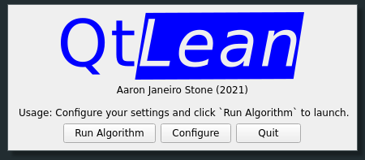
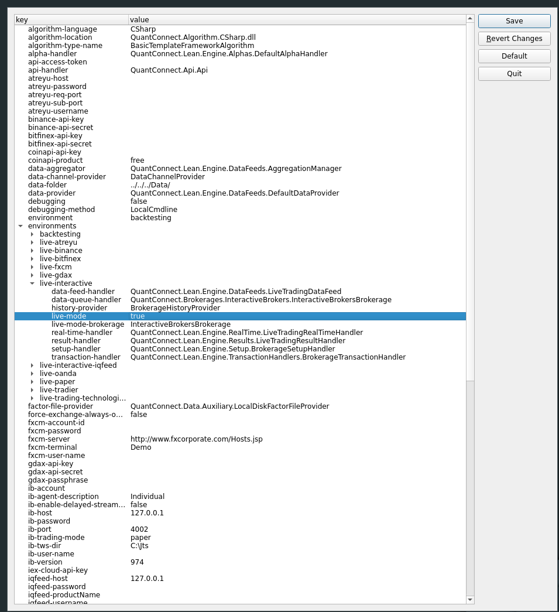

# QtLean

A Qt interface and build system for QuantConnect's Lean (WIP).

Pictures
--------

- Main UI

  


- Configuration editor
  
  

Current Features
-----------------

1. JSON TreeView editor.
2. Automatic Mono + Python setup.

TODO
----

1. Add charting.

Dependencies
------------

- Python 3.6
- Mono
- Nuget
- QT 6

Building and Installing
-----------------------
The project can be built by running:

```shell
mkdir build && cd build
cmake ..
make

```

and installed to /usr/ by running:

```shell
mkdir build && cd build
cmake -DCMAKE_BUILD_TYPE=Release ..
make install
```

If you run into issues, note that one can execute `make {OPTION}` for any of the following options:

````
... all (the default if no target is provided)
... clean
... depend
... edit_cache
... rebuild_cache
... copy_config_files
... qtlean_autogen
... qtlean
... qtlean_autogen/mocs_compilation.o
... qtlean_autogen/mocs_compilation.i
... qtlean_autogen/mocs_compilation.s
... src/QJsonModel.o
... src/QJsonModel.i
... src/QJsonModel.s
... src/TreeEditor.o
... src/TreeEditor.i
... src/TreeEditor.s
... src/main.o
... src/main.i
... src/main.s
````

Usage
-----
From your build directory, enter the Lean subdirectory and execute

```shell
../QtLean
```

If QtLean is installed, it can be called from any Lean directory by executing:

```shell
QtLean
```

Although do note that Python may need to be manually configured if the Lean directory is not the one generated by CMake.

Python Config Errors
--------------------

**If your Python is unable to be configured via CMake, run the following in your Lean root directory and then build the
Lean solution with mono:**
[py_configure.sh](https://raw.githubusercontent.com/aarjaneiro/Lean/0c7fc24c316fbc6e05ff0d2ec07863c1d7a491e1/py_configure.sh)
